# Sowing 🌱 사용 설명서

> **한국 교사를 위한 로컬-우선 노트 도구.**
> 메모 한 줄에서 시작해 30년 누적 회상까지 — **범주(카테고리)** 를 뼈대로 한 기록의 흐름.

이 문서는 **처음 Sowing 을 시작하는 베타 테스터** 를 위한 가이드입니다. 평소 학교에서 메모·필기·기록을 쓰는 그대로 진행하시면 됩니다 — "AI 친화적" 으로 의식하실 필요 0.

---

## 목차

1. [왜 Sowing 인가 — 5가지 약속](#1-왜-sowing-인가--5가지-약속)
2. [기록의 큰 흐름 — 메모 → 필기 → 기록](#2-기록의-큰-흐름--메모--필기--기록)
3. [첫 5분 — 메모 한 줄로 시작](#3-첫-5분--메모-한-줄로-시작)
4. [**범주(카테고리) 중심** — 분류의 정신](#4-범주카테고리-중심--분류의-정신)
5. [태그 — 카테고리 횡단 색인](#5-태그--카테고리-횡단-색인)
6. [위키링크 — 노트 간 연결](#6-위키링크--노트-간-연결)
7. [30년 시나리오 — 시간 축의 회상](#7-30년-시나리오--시간-축의-회상)
8. [합성기 — 패턴을 끌어올리는 16종](#8-합성기--패턴을-끌어올리는-16종)
9. [검토와 수락 — 자율 mutation 0](#9-검토와-수락--자율-mutation-0)
10. [설정 — 학급 명단, 백업, LLM 모드](#10-설정--학급-명단-백업-llm-모드)
11. [자주 묻는 질문](#11-자주-묻는-질문)

---

## 1. 왜 Sowing 인가 — 5가지 약속

Sowing 은 다음 **5가지를 거부** 합니다 (ADR-013):

| 거부 | 의미 |
|---|---|
| 챗봇 X | 대화창 없음. 도구일 뿐, 친구가 아님. |
| 자동 글쓰기 X | LLM 이 사용자 대신 쓰지 않음. 사용자 입력이 항상 진실. |
| 클라우드 강제 X | 모든 데이터는 로컬 마크다운 파일. 클라우드 옵션은 사용자 선택. |
| 의인화 X | "선생님 오늘 힘드셨죠?" 같은 가짜 공감 0. |
| 자율 mutation 0 | LLM·자동 분석은 검토 대기 폴더 (`.sowing/synth/`) 에만 작성. 사용자 클릭 없이는 정식 기록이 되지 않음. |

대신 다음을 **약속** 합니다:

1. **마크다운 SoT (Source of Truth)** — 모든 데이터는 `.md` 파일. 옵시디언·iA Writer·VS Code 어디서든 열림.
2. **30년 누적 설계** — 매 학년 새 폴더가 아니라, `30_Records/{YYYY}/{카테고리}/` 한 흐름으로 누적.
3. **로컬 우선** — SQLite 인덱스는 캐시. 마크다운만 있으면 재구축 가능.
4. **외부 의존성 0 (LLM 옵션 제외)** — 인터넷 없이도 모든 기능 정상.
5. **사용자 명시 클릭** — 어떤 자동 산출물도 검토→수락 전엔 정식 기록 아님.

---

## 2. 기록의 큰 흐름 — 메모 → 필기 → 기록

Sowing 의 3 mode 는 **휘발성 → 영구성** 의 자연스러운 흐름입니다.

| Mode | 폴더 | 성격 | 시간 가치 |
|---|---|---|---|
| 💭 **메모** | `00_Inbox/` | 떠오르는 한 줄, 임시 | 며칠 ~ 몇 주 |
| 📝 **필기** | `20_Notes/{카테고리}/` | 정리·연결, 작업 중 | 한 학기 |
| 📖 **기록** | `30_Records/{YYYY}/{카테고리}/` | 보존, 분류 | 30년 누적 |

```
00_Inbox/        ← 메모: "민준이가 처음 발표 자원했다"
   ↓ (정리·확장)
20_Notes/        ← 필기: "학생 관찰: 민준" — 위키링크·태그 정리
   ↓ (완성·분류)
30_Records/      ← 기록: 30_Records/2026/학생기록/학생관찰-민준.md
```

흐름의 핵심은 **억지로 모든 메모를 기록으로 끌어올릴 필요 없다** 는 점입니다. 대부분의 메모는 휘발돼도 좋습니다 — 중요한 것만 자연스럽게 위로 올라갑니다.

### 필기 목록 — `/notes`

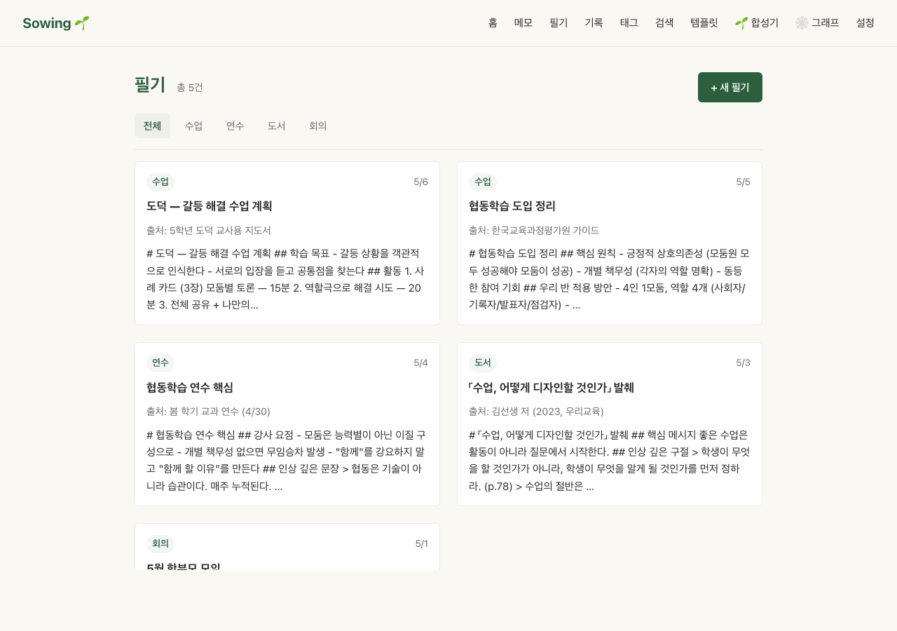

필기는 메모보다 정돈된 단계 — 카테고리가 이미 정해져 있고 (`lessons` / `meetings` / `books` / 또는 자유), 위키링크로 다른 노트들과 묶입니다. **CodeMirror 6 기반 마크다운 에디터** 가 위키링크 자동완성·실시간 프리뷰를 지원합니다.

---

## 3. 첫 5분 — 메모 한 줄로 시작

설치 직후 진입하면 대시보드 (`/`) 가 보입니다:

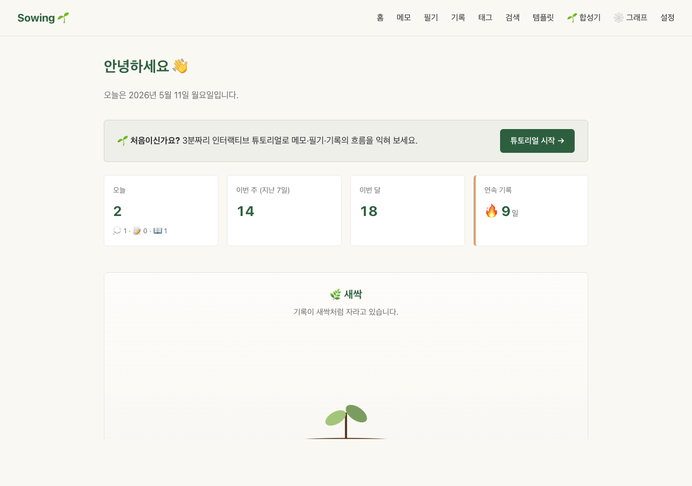

대시보드 구성:
- **오늘 / 이번 주 / 이번 달** — 작성 통계
- **연속 기록** — 🔥 streak (매일 하나씩 쌓는 동기부여)
- **성장 단계** — 🌱 새싹 → 🌿 줄기 → 🌳 거목 (30년 누적 시각화)
- **최근 메모** — 빠른 회상
- (데이터 누적 시) **이날의 회고** — 같은 월·일 과거 entries
- **합성기 검토** — 16종 합성기의 검토 대기 카운트

### 메모 작성 — 어디서든 ⌘+Shift+M

가장 빠른 시작 방법:

1. 어떤 화면에서든 **`⌘ + Shift + M`** (Mac) / **`Ctrl + Shift + M`** (Windows/Linux) 누르기
2. 모달 창에 한 줄 작성
3. **Enter** — 즉시 저장 (`00_Inbox/` 폴더에 마크다운 파일로)

이게 전부입니다. 분류 0, 제목 0, 카테고리 0 — **떠오르는 그대로**.

### 메모 목록 — `/memos`

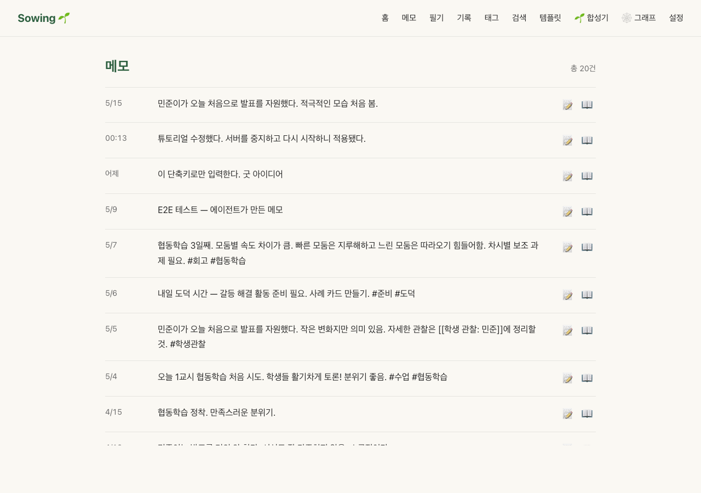

- 최신순 정렬 — 가장 최근이 위
- 본문에서 자동 추출된 **태그** (`#수업`, `#회고`) 와 **위키링크** (`[[학생 관찰: 민준]]`) 가 즉시 활성
- 아이콘: 📝 = 필기로 승격, 📖 = 기록으로 승격

> 💡 **승격(promote)**: 메모를 그대로 두지 않고 더 영구적인 mode 로 옮기는 동작. UI 의 📝 / 📖 아이콘 클릭으로 한 번에.

---

## 4. **범주(카테고리) 중심** — 분류의 정신

여기가 Sowing 의 **핵심 철학** 입니다.

다른 도구들 (옵시디언·Notion·Roam) 은 **자유 연결** 을 강조합니다. Sowing 은 다릅니다 — **범주가 먼저, 연결은 그 위에**.

### 왜 범주가 먼저인가

교사의 1년은 자연스러운 범주가 있습니다:

- **수업** — 매일 일어나는 본업
- **수업회고** — 그 날 끝난 후의 반성
- **학생기록** — 누군가에 대한 관찰
- **상담** — 학부모·학생과의 대화
- **평가** — 시험·과제 결과 분석
- **학급운영** — 일상 운영 (자리, 청소, 규칙)
- **학기회고** — 한 학기를 돌아본 큰 회고
- **연수** — 외부 학습
- **도덕수업** — 교과별 특화

**범주가 명확하면** 30년 후에도 찾을 수 있습니다. "2032년 학생 민준이 발표 변화" — 범주 (`학생기록`) + 시간 (`2032`) 두 축으로 즉시 도달.

### 기록 목록 — 범주 chip 으로 필터

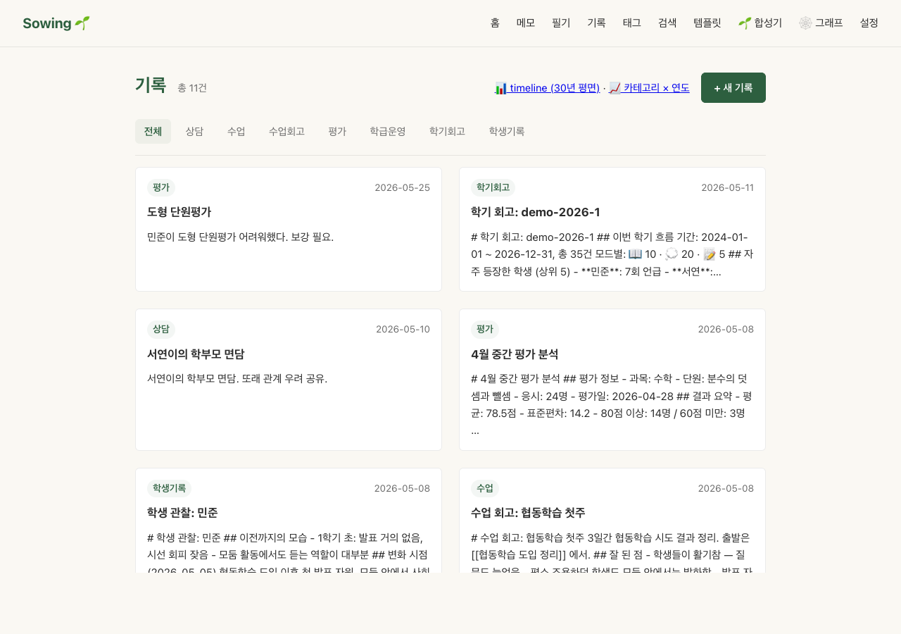

상단의 **카테고리 chip** (전체 / 상담 / 수업 / 수업회고 / 평가 / 학급운영 / 학기회고 / 학생기록) — 한 번 클릭으로 해당 범주만 필터.

각 카드:
- **카테고리 뱃지** (좌상단) — 범주 즉시 식별
- **날짜** (우상단)
- **제목 + 발췌**

### 카테고리 × 연도 매트릭스 — 30년 한 화면

기록 목록 우측 상단의 **📈 카테고리 × 연도** 클릭:

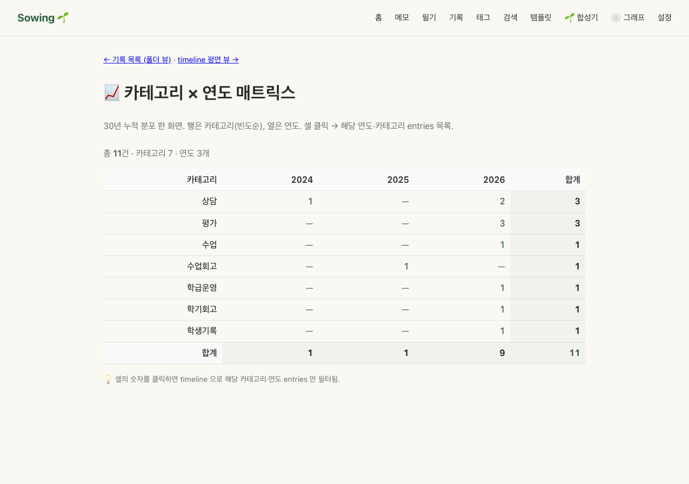

- **행** = 카테고리 (빈도순)
- **열** = 연도
- **셀** = 해당 (카테고리, 연도) entry 수
- **셀 클릭** → timeline 에 해당 (카테고리, 연도) 만 필터

30년 후 이 매트릭스를 보면:
- 어떤 범주가 꾸준히 누적됐는지 (수업회고 = 매년 50건+)
- 어떤 해는 특정 범주가 비어있었는지 (2028년 상담 0 — 그 해 무슨 일이 있었나?)
- 어떤 범주가 새로 생겼는지 (2030년 "AI도구활용" 신설)

**이 매트릭스가 Sowing 의 가장 강력한 30년 회상 도구** 입니다.

### Timeline — 시간 평면 뷰

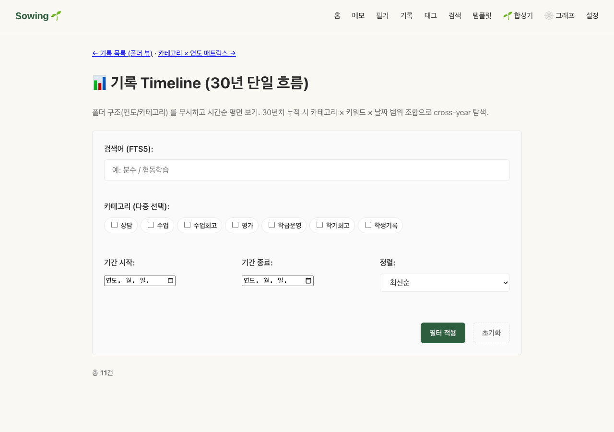

- 일별로 entries 점/색 표시
- 카테고리·연도 필터 적용 (URL `?category=...&year=...`)
- 매트릭스에서 셀 클릭 시 자동 필터되어 진입

---

## 5. 태그 — 카테고리 횡단 색인

카테고리가 **수직 분류** (폴더 구조) 라면, 태그는 **수평 색인** 입니다.

### 태그 작성

본문에 `#태그명` — 어디서든.

```markdown
오늘 협동학습 도입 3일째. 모둠별 속도 차이가 큼. #회고 #협동학습
```

작성 시 자동으로 인덱싱돼 `/tags` 에 노출:

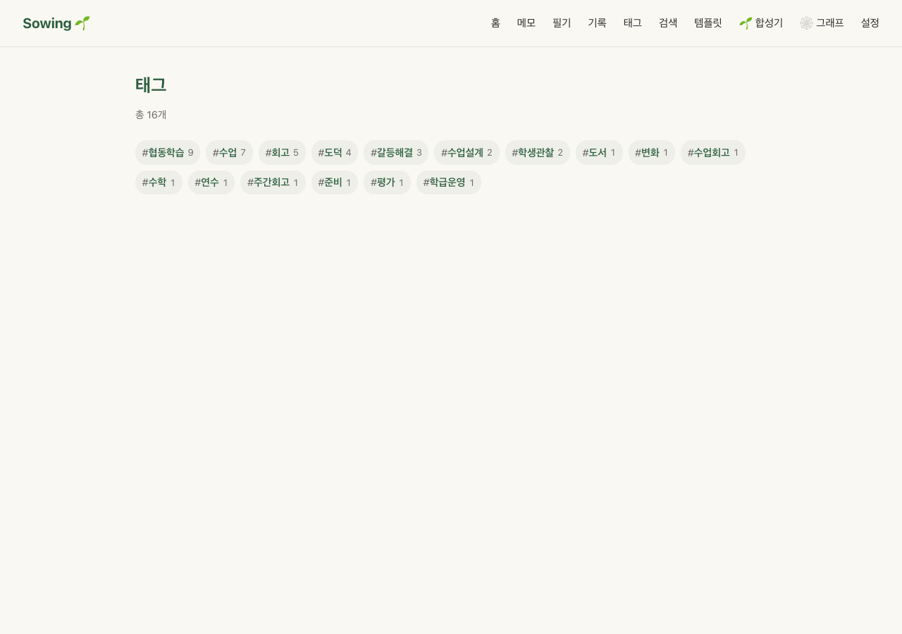

각 태그 chip 의 숫자 = 사용된 entries 수. 클릭하면 해당 태그를 가진 모든 entries (메모·필기·기록 무관) 가 시간순으로.

### 카테고리 vs 태그 — 언제 무엇을?

| 상황 | 카테고리 | 태그 |
|---|---|---|
| 본질적 분류 | ⭕ 폴더 자체가 카테고리 | ❌ |
| 횡단 주제 (여러 범주 공통) | ❌ | ⭕ `#협동학습` |
| 일회성 라벨 | ❌ | ⭕ `#준비` |
| 학생 이름 | ❌ (위키링크 사용) | △ `#학생관찰` |

규칙: **카테고리는 1개, 태그는 0~N개**. 한 기록의 본질은 하나지만, 가로질러 묶을 키워드는 여럿일 수 있습니다.

---

## 6. 위키링크 — 노트 간 연결

본문에 `[[다른 노트 제목]]` — 옵시디언 호환 구문.

```markdown
민준이가 오늘 처음으로 발표를 자원했다.
자세한 관찰은 [[학생 관찰: 민준]]에 정리할 것.
```

저장 즉시 자동으로:
- 링크가 파란색으로 활성 (UI 에서 클릭 가능)
- 대상이 없으면 회색 (미완성 링크 — 클릭 시 생성 프롬프트)
- **그래프** (`/graph`) 에 노드·엣지로 표시

### 그래프 시각화

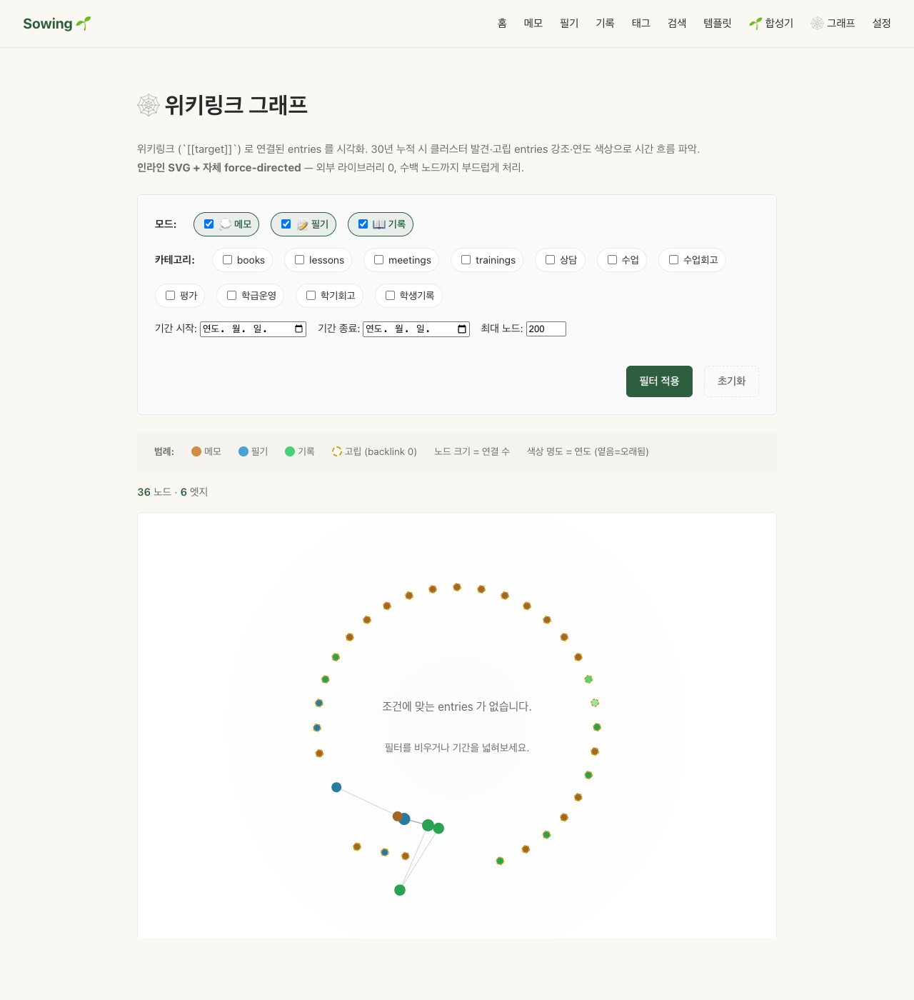

- **노드 색** = 모드 (메모/필기/기록)
- **노드 크기** = 연결 수 (많을수록 큼)
- **고립 노드** = backlink 0 (어디서도 참조되지 않은 노트)
- **카테고리 필터** = 특정 범주의 그래프만 보기

> 💡 **고립 노트** 가 중요합니다. 30년 누적 시 이런 노트들이 진짜 잊혀진 발견 — 합성기 #5 `orphan-detection` 이 자동으로 모아줍니다.

---

## 7. 30년 시나리오 — 시간 축의 회상

Sowing 의 가장 큰 차별점: **30년 후에도 동작합니다**.

### 4가지 cross-year 탐색 도구

1. **이날의 회고** (대시보드) — 오늘과 같은 월·일의 과거 연도 entries 자동 표시. "5월 11일 — 2024년에도 똑같은 갈등이 있었구나."
2. **카테고리 × 연도 매트릭스** (`/records/by-category`) — 위 §4 참조.
3. **Timeline** (`/records/timeline`) — 일별 평면, 색·점으로 누적 분포.
4. **합성기 전체기간 preset** — 합성 폼의 `📅 전체 기간 (30년)` 버튼 클릭 시 since/until 자동 채움.

### "30년 누적" 의 실제 의미

| 연차 | 시나리오 |
|---|---|
| 1년차 | 메모·필기 가벼움. 합성기 출력은 빈약. **이 때 사용 습관 형성** 이 가장 중요. |
| 3년차 | 카테고리별 100건+ 누적. "작년 이맘때 도덕수업 어떻게 했지" 검색 1초. |
| 5~10년차 | 매년 회고 가능. **합성기 self-patterns** (메타-합성) 가 본인의 집필 패턴 분석. |
| 20~30년차 | 매일 "이날의 회고" 가 자연스럽게 채워짐. 후임에게 인계할 자산. |

**핵심**: 1년차에 가장 가볍게 시작하세요. 매일 한 줄 메모로도 충분합니다.

---

## 8. 합성기 — 패턴을 끌어올리는 16종

축적된 메모·필기·기록에서 **패턴을 자동 추출** 하는 도구. `/synth` 에서 16종 사용 가능.

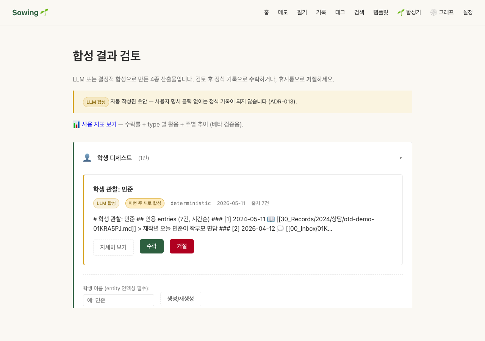

### 16 type 분류

| 분류 | 합성기 | 용도 |
|---|---|---|
| 학생 중심 | 학생 디제스트, 학기 회고, **학생 묘사 변화** | 학생 개인 추적 |
| 수업·학습 | 수업 패턴, 수업 시리즈, **학습 진척 추이** | 교과·차시 분석 |
| 학부모·평가 | 상담 준비, **상담 패턴** (학기), 평가 누적, 연수 흡수 | 외부 기록 |
| 횡단 | 주간 회고, 고립 메모, 태그 클러스터, 계절성 | 자율 발견 |
| 메타 | **자기 회고 패턴** (교사 본인), **사건 인과 추론** | 회고·해석 |

**굵게** 표시된 5종이 v0.1.1 의 새로운 합성기 (16 type 완성).

### 결정적 vs LLM 모드

각 합성기는 두 모드를 지원:

| 모드 | 비용 | 속도 | 출력 |
|---|---|---|---|
| **결정적 (기본)** | 0 | 즉시 | 통계·인용 — 객관적 사실만 |
| **LLM (선택)** | $0.008~$0.12 | 5~30s | 자연어 패턴 분석 — 해석·역추론 |

LLM 모드는 `.env` 에 `ANTHROPIC_API_KEY=sk-ant-...` 설정 시 자동 활성. UI 에 체크박스 + 모델 드롭다운 (Haiku 4.5 / Sonnet 4.5 / Opus 4.7) 표시:

```
☑ 🌱 LLM 모드 — 자연어 패턴 분석
모델: [Haiku 4.5 — 저비용·빠름 (≈ $0.0080 / 합성 1건, 2~5s) ▼]
```

체크 안 하면 결정적 모드 (즉시·무료).

### 합성기 사용 흐름

1. `/synth` 진입
2. 16 type 중 하나 펼치기 (예: "학생 디제스트")
3. 폼 작성:
   - 학생 이름 (예: "민준")
   - 기간 (선택, 전체 기간 버튼)
   - (선택) LLM 모드 체크 + 모델 선택
4. **생성/재생성** 클릭
5. 결과가 `.sowing/synth/students/민준.md` 에 작성됨 (정식 기록 아님 — 검토 대기)
6. 카드에서 **자세히 보기** → 본문 확인 → **수락** or **거절**

---

## 9. 검토와 수락 — 자율 mutation 0

ADR-013 의 핵심 원칙: **사용자 명시 클릭 없이는 정식 기록이 되지 않음**.

### 합성 결과 카드

```
┌─ 학생 관찰: 민준 ─────────────────────────────────┐
│ [LLM 합성] [이번 주 새로 합성] Anthropic 2026-05-11 출처 7건 │
│                                                  │
│ # 학생 관찰: 민준                                 │
│ ## 인용 entries (7건, 시간순)                     │
│ ### [1] 2024-05-11 📖 [[30_Records/2024/...]]     │
│ ...                                              │
│                                                  │
│ [자세히 보기]  [수락]  [거절]                     │
└──────────────────────────────────────────────────┘
```

3 액션:

| 액션 | 결과 | 비고 |
|---|---|---|
| **자세히 보기** | 마크다운 렌더링 + 위키링크 활성. 변경 없음. | 안전 — 미리보기. |
| **수락** | `30_Records/{YYYY}/{accept_category}/` 으로 이동. 정식 기록. | ULID 새 할당, 인덱싱. |
| **거절** | `.sowing/trash/` 휴지통 이동. 30일 후 자동 삭제. | 복구 가능 (`.sowing/trash`). |

수락 후 정식 기록은 다음과 같이 보입니다 — 카테고리 뱃지 + 날짜 + 마크다운 본문 + 편집 가능:

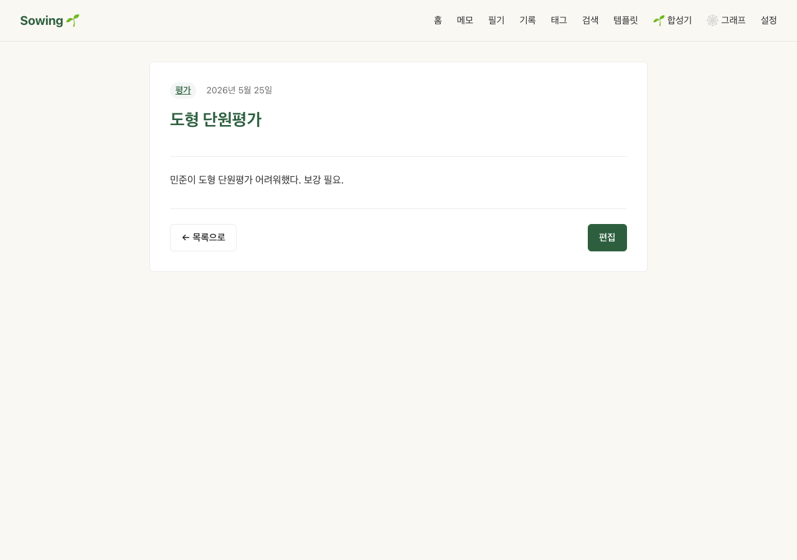

이후 검색·timeline·매트릭스·합성기 모두에서 일급 시민으로 노출됩니다.

### 수락 시 자동 분류

각 합성기는 **수락 시 카테고리** 가 미리 정해져 있습니다:

| 합성기 | 수락 카테고리 |
|---|---|
| 학생 디제스트 | `학생기록` |
| 학기 회고 | `학기회고` |
| 수업 패턴 | `수업회고` |
| 상담 준비 | `상담` |
| 평가 누적 | `평가` |
| 연수 흡수 | `연수` |

검토 → 수락 한 번으로 자동 분류 + 정식 보존 + 30년 검색 가능.

### 베타 검증 — 사용 지표

`/synth/metrics` 에서 본인의 검토·수락 통계 확인:

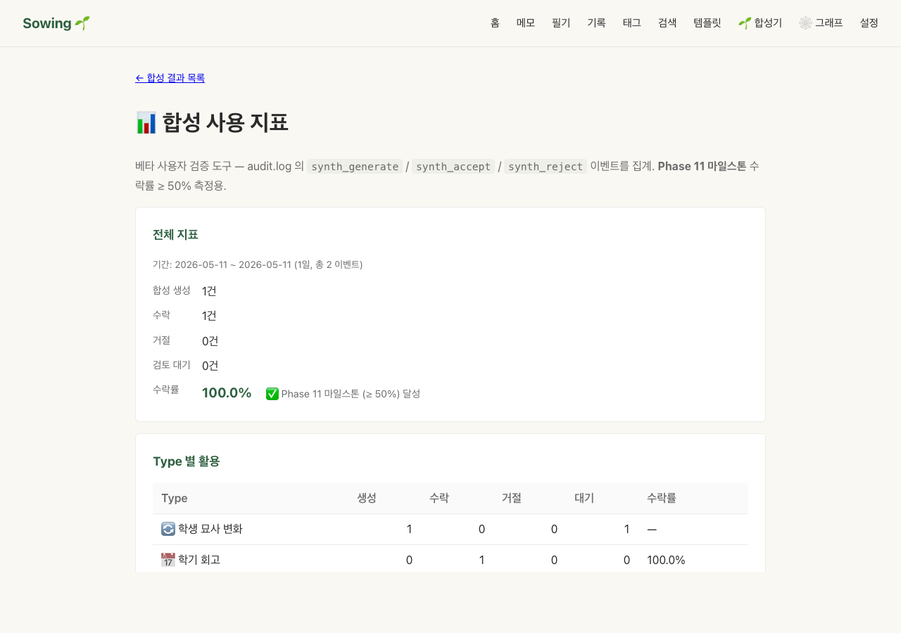

- **전체 지표**: 수락률 % + Phase 11 마일스톤 (≥50%) 자동 판정
- **Type 별 활용**: 합성기 16종 각각의 생성·수락·거절·대기 카운트
- **주별 추이**: 최근 8주 사용 패턴

베타 인터뷰에서 가장 유용한 데이터입니다.

---

## 10. 설정 — 학급 명단, 백업, LLM 모드

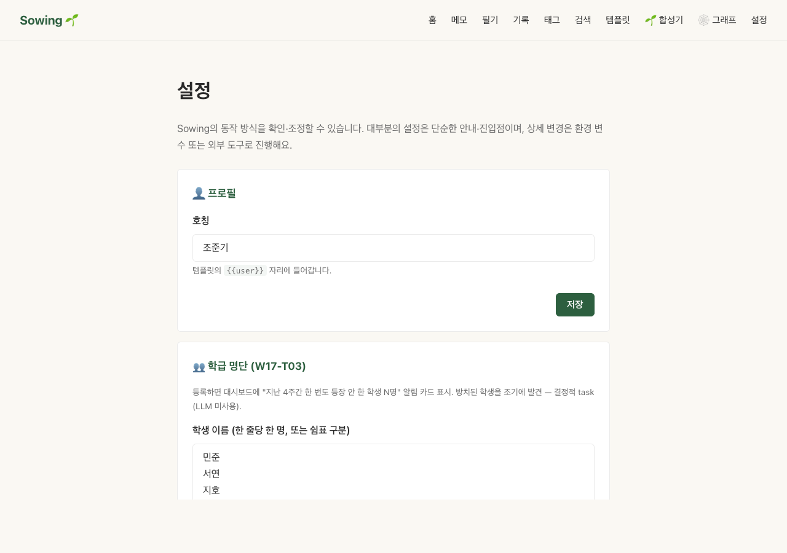

### 학급 명단 — 미언급 학생 자동 감지

`/settings` → **학급 명단** 에 학생 이름 입력 (한 줄 한 명):

```
민준
서연
지호
유나
...
```

저장 후 대시보드에 자동 표시:
- **⚠ 지난 4주간 한 번도 등장 안 한 학생 3명** — 클릭하면 명단 펼침
- 합성기 #9 `parent-patterns` 가 학기 상담 패턴 분석 시 활용

### LLM 모드 설정

프로젝트 루트의 `.env` 파일:

```bash
ANTHROPIC_API_KEY=sk-ant-...
# 선택 — 기본 모델 변경
# ANTHROPIC_MODEL=claude-sonnet-4-5-20250929
```

설정 후 앱 재시작 → `/synth` 의 4 LLM-capable 폼 (parent-patterns, self-patterns, event-causality, contradictions) 에 체크박스 자동 표시.

**API 키가 없어도 결정적 모드로 16종 모두 정상 작동** — LLM 은 패턴 해석 품질 향상용 옵션.

### 백업 — vault 폴더 통째로

Sowing 의 모든 데이터는 `~/Documents/SowingVault/` (macOS 기본):

```
SowingVault/
├── 00_Inbox/           ← 메모
├── 20_Notes/           ← 필기
├── 30_Records/         ← 기록 (30년 누적)
├── 10_Templates/       ← 템플릿
└── .sowing/            ← 인덱스·합성·휴지통 (재구축 가능)
```

이 폴더를:
- iCloud Drive 안에 두면 자동 백업
- Dropbox / Google Drive 동기화
- 외장 디스크에 주기적 복사
- 옵시디언 vault 로 동시 사용 가능 (양방향 호환)

**.sowing/ 디렉토리는 재구축 가능** — 마크다운 파일들만 잃지 않으면 됩니다.

---

## 11. 자주 묻는 질문

### 검색이 안 돼요

`/search?q=키워드` — SQLite FTS5 풀텍스트 검색. 한국어 형태소 분석 포함.

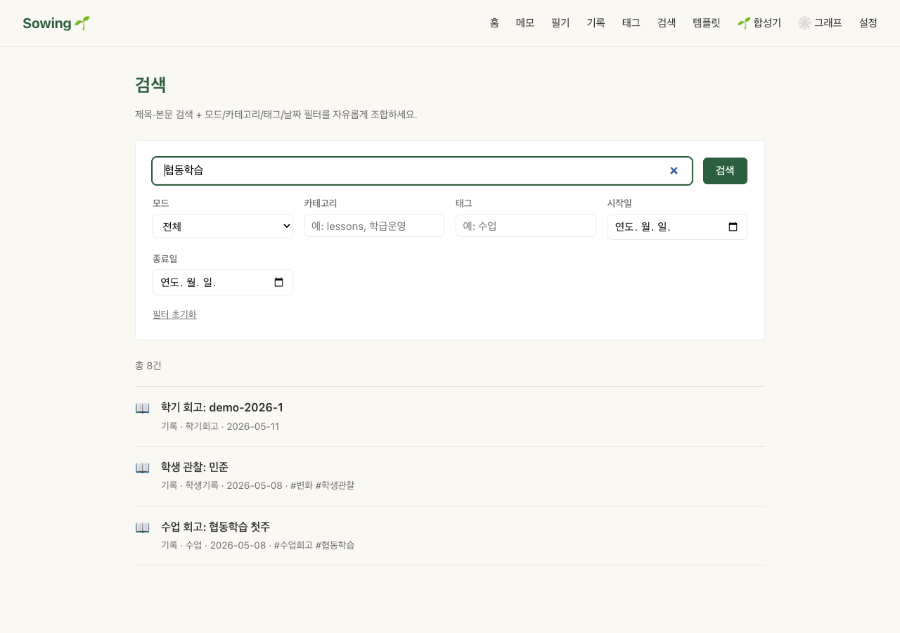

검색 결과가 0건이면:
- 인덱스 손상 가능 — `bin/sowing-doctor` 실행 후 `bin/sowing reindex` 로 재구축
- 띄어쓰기 변형 시도 ("협동학습" → "협동 학습")
- 카테고리 필터 해제

### 메모를 잘못 적었어요

UI 에서 메모 클릭 → **편집** 버튼. 본문 수정 + 저장.

또는 옵시디언 / VS Code 로 `00_Inbox/{메모-id}.md` 직접 편집 — Sowing 이 파일 변경 감지 후 자동 인덱싱.

### 메모를 영구히 삭제하려면

UI 에서 메모 카드의 **🗑 거절** 버튼. `.sowing/trash` 로 이동 (30일 후 자동 삭제).

즉시 영구 삭제: `rm 00_Inbox/{메모-id}.md`.

### 위키링크 대상이 없어요 (회색)

`[[학생 관찰: 민준]]` 작성 시 대상이 없으면 회색 표시. 클릭하면 빈 노트 생성 프롬프트.

또는 일부러 placeholder 로 둘 수도 있습니다 — 나중에 노트를 만들면 자동 연결.

### 동시에 여러 기기에서 사용해도 되나요

가능하지만 **권장하지 않음**:
- vault 폴더를 iCloud/Dropbox 로 동기화 + 한 번에 한 기기에서만 사용 → 안전
- 두 기기 동시 사용 시 SQLite 동시 쓰기로 인덱스 충돌 가능

베타 기간엔 **데스크톱 1대** 권장.

### LLM 비용이 걱정돼요

| 사용 패턴 | 월 추정 비용 |
|---|---|
| 결정적만 사용 | $0 |
| 매주 LLM 합성 1회 (Haiku) | ≈ $0.03 |
| 매일 LLM 합성 1회 (Haiku) | ≈ $0.24 |
| 매주 Sonnet 합성 1회 | ≈ $0.10 |
| 매주 Opus 합성 1회 | ≈ $0.50 |

UI 에 매 합성마다 추정 비용 ($0.0080 / 합성 1건 형식) 표시 — 알고 누름.

### 베타 후 어떻게 되나요

- 데이터는 100% 본인 소유 (로컬 마크다운). Sowing 사용 중단해도 옵시디언 / VS Code 로 그대로 사용 가능.
- 베타 의견은 [BETA_GUIDE.md](BETA_GUIDE.md) 의 측정 기준에 반영됩니다.
- v1.0 정식 출시 시 베타 데이터는 그대로 호환됩니다.

---

## 다음 단계

1. **첫 주**: 매일 메모 1~3개. 그게 전부.
2. **2~3주차**: 자주 등장한 메모를 필기로 승격 (📝 아이콘). 카테고리 = `lessons` / `meetings` / `books` 중 자연스러운 것.
3. **1개월차**: 큰 회고를 기록으로 (📖 아이콘). 첫 카테고리 (`수업회고`, `상담`) 결정.
4. **2개월차**: `/synth` 에서 첫 합성기 시도. 결정적 모드로 충분.
5. **한 학기 후**: `/synth/metrics` 확인 + 베타 인터뷰.

---

## 도움이 필요할 때

- **`bin/sowing-doctor`** — 진단 도구 (인덱스 정합성, vault 경로 등)
- **`docs/KNOWN_ISSUES.md`** — 알려진 제약사항
- **GitHub Issues** — https://github.com/junkicho-lab/sowing/issues
- **베타 가이드** — [BETA_GUIDE.md](BETA_GUIDE.md) (테스터 측정 기준)

**핵심 한 줄**: 메모 한 줄에서 시작해, 30년 누적까지 — **범주가 뼈대, 시간이 흐름**.

🌱
